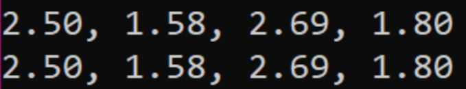
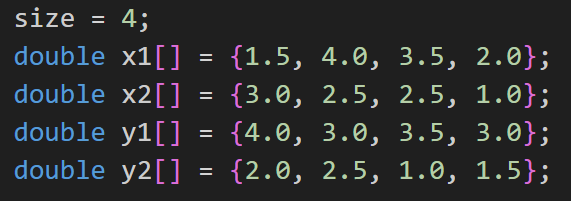

# x86-to-C-interface 
LBYARCH Machine Project

### Collaborators
- byanka8: Bianca Sollesta
- MoominHana: Bea Sollesta

### MP Specs
The kernel must calculate the distances between the coordinate points accross two vectors.
- Required to use functional scalar SIMD registers
- Required to use functional scalar SIMD floating-point instructions
---

### Comparative Execution Time and Short Analysis of the performance of the kernels
Upon running the computations and timing of both kernels, it is evident that both C and Assembly have almost the same execution time, where sometimes Assembly would be faster 1 ns than C. This is due to the low-level nature of Assembly, allowing more direct control over hardware and optimizations.

---
### Screenshot: Program Output Correctness Check

- 1st Row: Output by C
- 2nd Row: Output by Assembly

Below is a sample input:

---
### Short Video
[x86-64 to C Interface Programming Project](x86-64-to-C.mp4)

